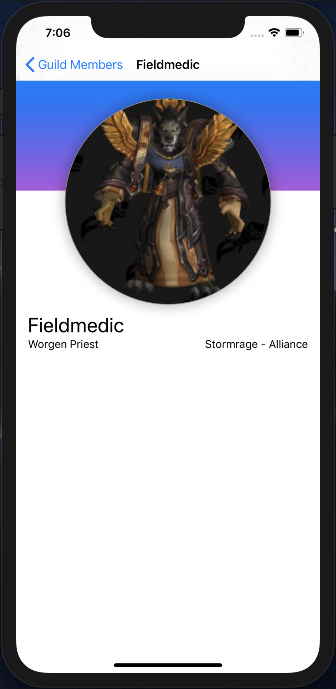

# SJSU CMPE235 Homework - iOS application in SwiftUI
### Objective
This project is to create a basic iOS application using Machine Learning provided by the Apple's Core ML API.

### User Experiences

  
  

