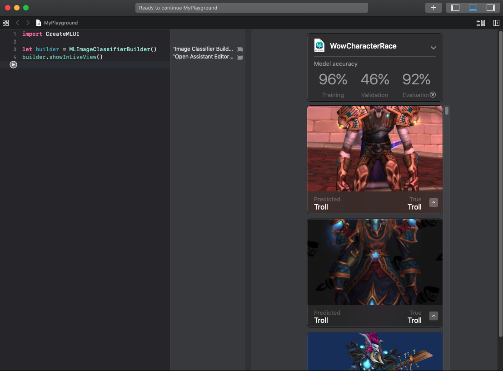

# SJSU CMPE235 Homework - iOS application in SwiftUI
### Objective
This project is to create a basic iOS application using Machine Learning provided by the Apple's Core ML API.

### Create Machine Learning model via CoreML
The CoreML provides a simple playground where one can easily create a custom Machine Learning model and can train with prepared data. For the homework project, 20 images per race were prepared and used to train the model. The size of the data would not be sufficient for production usage, but it was enough to give the prediction with quite good accuracy.

    

### User Experience
The application utilizes the model trained through the CoreML API. And on click of the user character detail page, the image will be processed by the model, and the result will be shown in the page asynchronosuly.

    

### References
- https://developer.apple.com/documentation/vision/classifying_images_with_vision_and_core_ml
- https://www.hackingwithswift.com/books/ios-swiftui/connecting-swiftui-to-core-ml
- https://medium.com/zipper-studios/how-to-add-a-machine-learning-model-to-your-ios-project-using-coreml-84d19f0ac524
- https://www.appcoda.com/create-ml/
